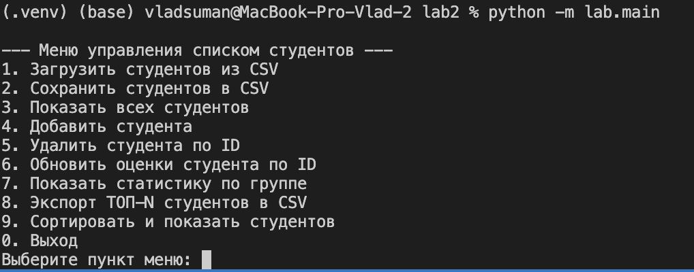

# Команды

## Установка и запуск

### Клонирование репозитория

```bash
git clone git@github.com:UladzislauShuman/university-python-course.git
cd university-python-course/lab2
```

### Инициализация окружения

```bash
# Создать виртуальное окружение
python3 -m venv .venv

# Активировать его
source .venv/bin/activate

# Установить все необходимые зависимости 
pip install -r requirements-dev.txt
```

### Запуск

Для запуска интерактивного консольного меню выполните команду из корневой папки проекта (`lab2`):

```bash
python -m lab.main
```

Вы увидите меню с доступными опциями.



### Функционал
- Комнда 1
    - Загружает из CSV-файла
    - Запрашивает, есть ли заголовок в файле(поля студентов)
- Команда 2
    - Сохраняет список студентов в CSV-файл
    - Спрашивает, нужно ли вносить заголовок в файл
    - Пример названия файла: `example/example.csv`
- Команда 3
    - Возвращает список текущих загруженных студентов
- Команда 4
    - Добавить студента
    - Нужно ввести
        - id (пример: 999)
        - ФИО (пример: Шуман Владислав Олегович)
        - Список оценок (пример: 93,90,100,99)
- Команда 5
    - Удалить студента по Id (пример: 999)
- Команда 6
    - Обновить список оценка студента
    - Поиск происходит по id
    - Вводите список и он полностью перезаписывает текущий список оценок (пример: 93,90,100,99)
- Команда 7
    - Возвращает статистику по группе
    - Если список пуст, то отобразиться сообщение
    - Если список не пуст, то в отчете будет отображено
        - Сколько всего студентов
        - Общий средний балл
        - Лучший студент
        - Худший студент
    - Пример
    ```
    --- Статистика по группе ---
    Всего студентов: 6
    Общий средний балл: 77.92
    Лучший студент: Иванов Олег (ср. балл: 95.00)
    Худший студент: Иванов Петр (ср. балл: 45.00)
    ```
- Команда 8
    - Экспорт ТОП-N студентов по среднему баллу
    - Требуется ввести название CSV-файла-вывода и Нужно ли выводить заголовок в файл (пример: `example/example.csv`)
    - В файл выведиться список из N студентов, сортированных по убыванию по средней оценке
    - Пример результате в файл для 3-х пользователей
    ```
    id,name,average,grades
    4,Иванов Олег,95.00,100 90
    3,Иванова Анна,91.67,92 88 95
    1,Иванов Иван,84.33,78 85 90
    ```
- Команда 9
    - Сортировать список студентов по полю
    - Требуется ввести критерий, по которому происходит сортировка (`id`, `name`, `avg`). Если ввести некорректный критерий, то выведиться сообщение с ошибкой
    - Если список студентов пуст, то выведиться сообщение с ошибкой, что список пуст
    - Пример
    ```
    Выберите пункт меню: 9
    Введите ключ сортировки (id, name, avg): avg

    --- Студенты, отсортированные по 'avg' ---
    ID: 4, Имя: Иванов Олег, Оценки: [100, 90], Средний балл: 95.00
    ID: 3, Имя: Иванова Анна, Оценки: [92, 88, 95], Средний балл: 91.67
    ID: 1, Имя: Иванов Иван, Оценки: [78, 85, 90], Средний балл: 84.33
    ID: 5, Имя: Иванова Юлия, Оценки: [80], Средний балл: 80.00
    ID: 6, Имя: Шуман Владислав Олегович, Оценки: [80], Средний балл: 80.00
    ID: 2, Имя: Иванов Петр, Оценки: [65, 70, 0], Средний балл: 45.00
    ```