# Лабораторная работа №2. Отчет

## Цели и задачи

*   **Цель:** 
    - Освоить базовые конструкции Python: условия и циклы.
    - Научиться проектировать функции и процедуры, разбивать программу на модули и пакеты.
    - Применить коллекции Python (списки, словари) для хранения и обработки данных.
    - Освоить обработку ошибок и исключений, проектирование собственных исключений.
    - Научиться работать с файлами: чтение/запись, формат CSV.
    - Освоить базовую автоматизацию тестирования с помощью pytest
*   **Задачи:**
    1.  Спроектировать и реализовать модель данных для сущности "Студент".
    2.  Реализовать логику для чтения и записи данных в формате CSV с обработкой различных краевых случаев.
    3.  Реализовать функции для обработки данных: сортировка, расчет статистики.
    4.  Создать интерактивное консольное меню для взаимодействия с пользователем.
    5.  Обработать типичные ошибки.
    6.  Покрыть функциональность автоматическими тестами с использованием фреймворка `pytest`.
    7.  Настроить CI с помощью GitHub Actions для автоматического запуска тестов.

## Архитектура проекта

Проект разбит на пакеты согласно требованиям в задании

*   `lab/`: Основной пакет приложения.
    *   `main.py`: Точка входа. Реализует консольный интерфейс.
    *   `models.py`: Определение моделей данных (класс `Student`(инкапсулирует данные о студенте и логику их валидации)).
    *   `io_utils.py`: Модуль для операций ввода-вывода. Содержит функции для чтения и записи CSV-файлов.
    *   `processing.py`: Модуль с функциями для бизнес-логики: сортировка студентов, расчет групповой статистики, экспорт данных.
    *   `errors.py`: Определяет иерархию пользовательских исключений для обработки ошибок, специфичных для логики приложения.
*   `data/`: Директория для хранения данных (CSV-файлы).
*   `tests/`: Пакет с тестами. Структура тестов индентична структуре основного пакета.
*   `.github/workflows/`: Директория для конфигурации CI/CD на GitHub Actions.

## Установка и запуск

### 1. Клонирование репозитория

```bash
git clone git@github.com:UladzislauShuman/university-python-course.git
cd university-python-course/lab2
```

### 2. Инициализация окружения

```bash
# Создать виртуальное окружение
python3 -m venv .venv

# Активировать его
source .venv/bin/activate

# Установить все необходимые зависимости 
pip install -r requirements-dev.txt
```

### 3. Запуск

Для запуска интерактивного консольного меню выполните команду из корневой папки проекта (`lab2`):

```bash
python -m lab.main
```

Вы увидите меню с доступными опциями.

## Примеры использования 

### 0
#### Меню

#### Нет такой команды
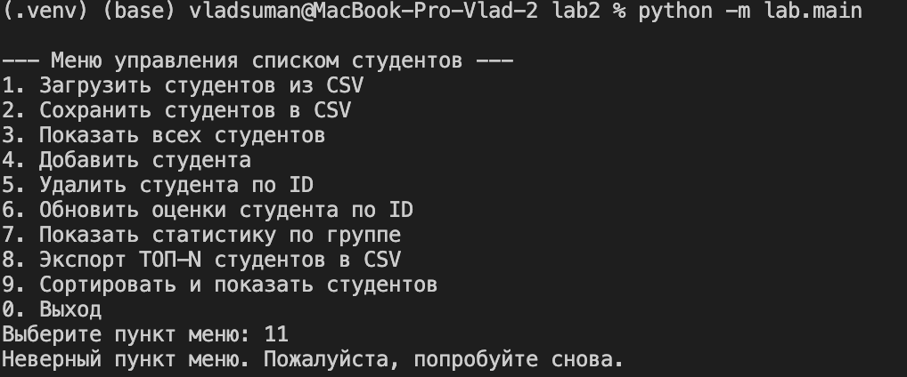
#### Выход
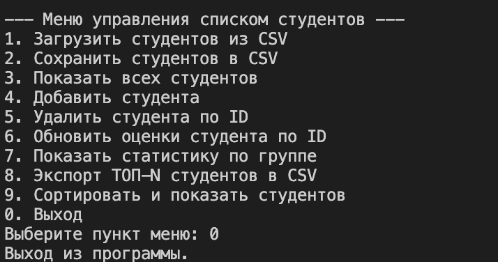

### 1 Загрузить студентов
#### Файла нет
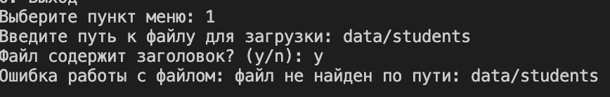
#### Неподдерживаемый тип
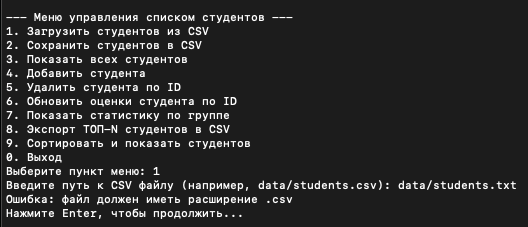
#### Успех
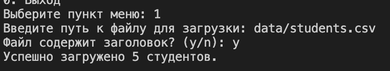

### 2 Сохранить студентов
#### Ниже

### 3 Посмотреть список
#### Есть студенты
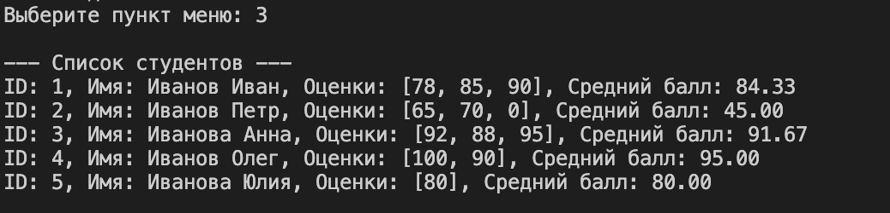

### 4 Добавить студента
####  Id уже существует
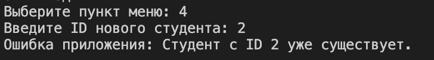
#### Отрицательная оценка
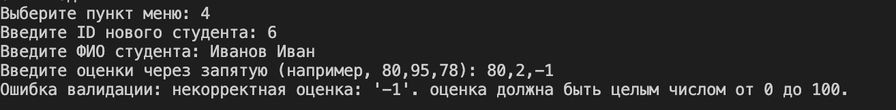
#### Успех
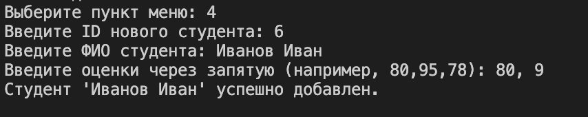
#### Результат
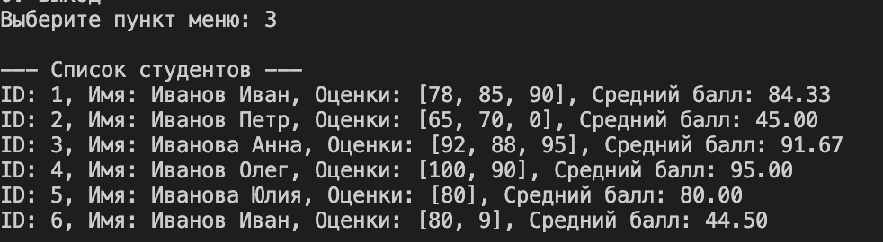


### 5 Удалить студента
#### Нет Id
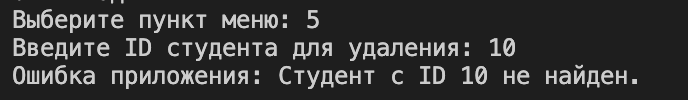
#### Успех
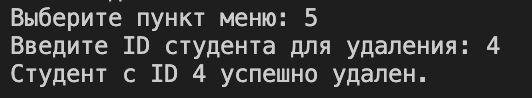
#### Результат
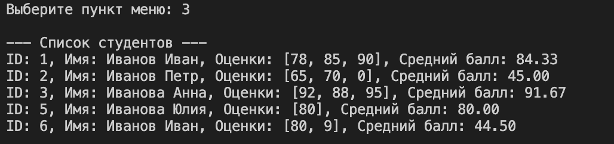

### 6 Обновить оценки студента
#### Успех
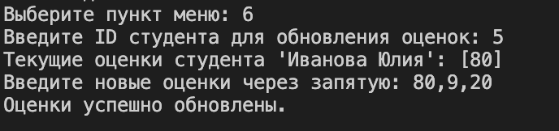
#### Результат
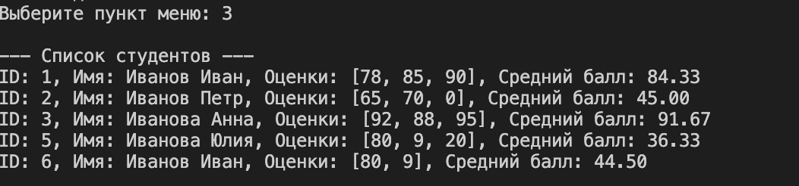

### 7 Статистика по группе
#### Успех
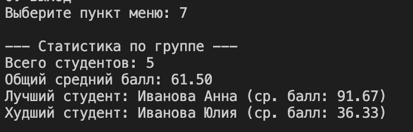

### 8 Экспортировать TOP-N
#### Успех
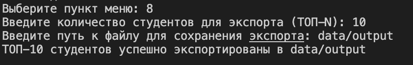
#### Результат
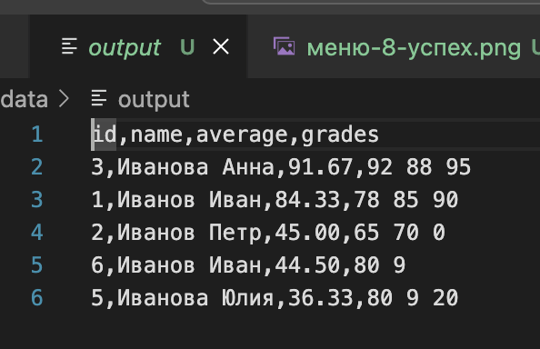

### 9 Сортировать студентов
#### Нет такого варианта
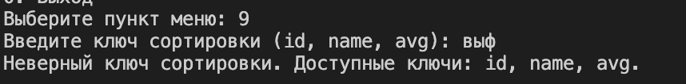
#### id
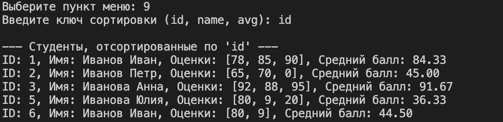
#### name
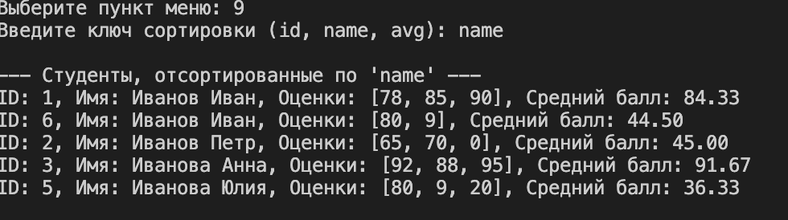
#### avg
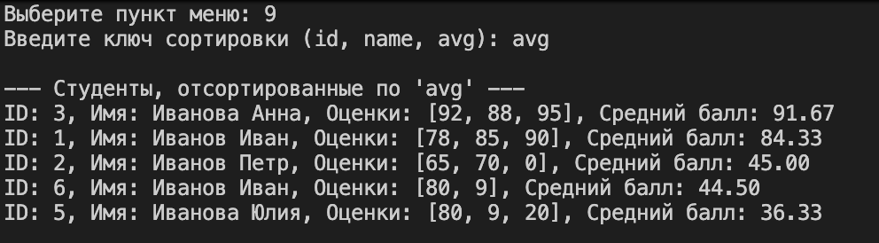


### 2
#### Неверное расширение файлов
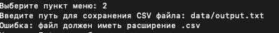
#### Успех
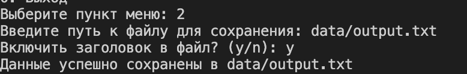
#### Файл-результат
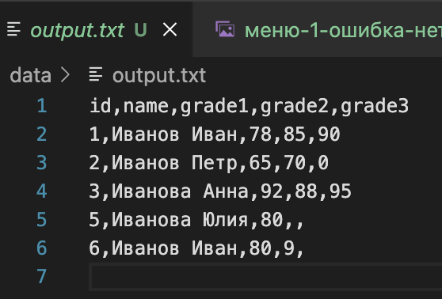

## Тестирование

Проект покрыт автоматическими тестами с использованием `pytest`. Тесты проверяют корректность модели данных, операций ввода-вывода, бизнес-логики и базовый сценарий работы CLI.

Для запуска тестов выполните команду:

```bash
pytest -v
```

### Результаты тестов

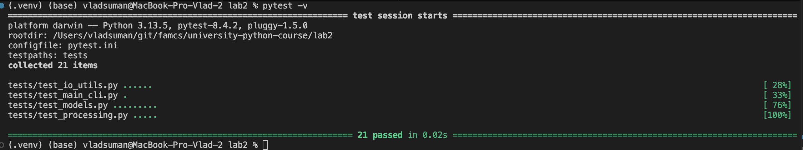

## Выводы

В ходе выполнения лабораторной работы были достигнуты все поставленные цели. 
- Было разработано консольное приложение согласно поставленным требованиям ТЗ лабораторной работы. 
- Реализована система обработки ошибок и валидации данных. 
- Ключевая функциональность покрыта автоматическими тестами, процесс проверки автоматизирован с помощью CI GitHub Actions.
- Тем самым получил навыки в проектировании приложения с помощью языка программирования Python, работе с файлами, обработке исключений и автоматизированном тестировании.